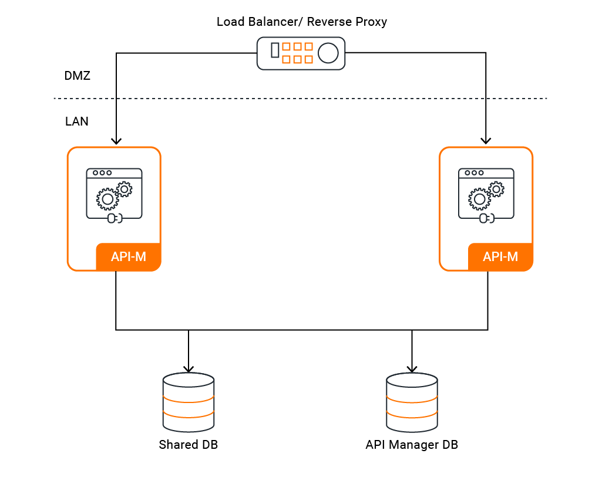

This scenario shows how to configure the WSO2 API Manager 4.2.0 fronted with a load balancer.
Although we use the nginx as the load balancer, any load balancer could be configured.

> **_NOTE:_** Please wait until the playground is ready to start the scenario.