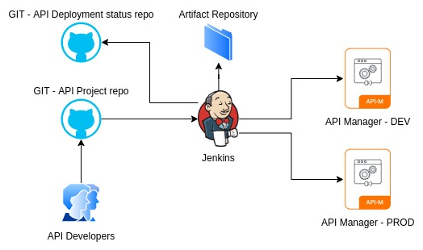

This scenario shows how to configure a ci/cd process with jenkins, github and apictl tool. 

Please note that the purpose of this lab is to show how to utilize the APICTL tool to build a API deployment automation. Even we use Jenkins and github for this scenario, you could use any CI/CD tool and create your own workfrow.

<b>[Important]

Please complete the followings steps while waiting for the environment to be ready.

- Create two git repositories under your github account
    - `api-source-repository` to store the API source projects
    - `api-deploy-state-repository` to mantain the deployment status

We are not using Artifact repository in this lab, just to save time and reduce the complexity. Please refer to the documentation on artifactory based configurations 

https://apim.docs.wso2.com/en/latest/install-and-setup/setup/api-controller/building-jenkins-ci-cd-pipeline/#building-the-pipeline
</b>

> **_NOTE:_** Please wait until the playground is ready to start the scenario.
