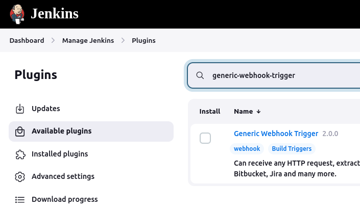
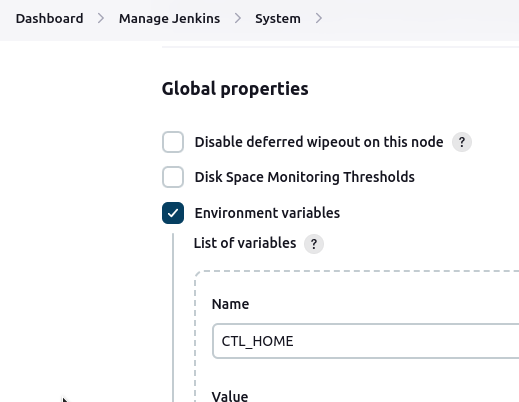

- Start the WSO2 API Manager on this node. We will use this instance as the DEV environment in our scenario

    `sh apim1/wso2am-4.2.0/bin/api-manager.sh start`{{exec}}

    Check the logs. Let it start, continue to the following steps while the API Manager is starting.

    `tail -f apim1/wso2am-4.2.0/repository/logs/wso2carbon.log`{{exec}}

- Install JSON parser for linux, which will be used by the pipelines

    `apt install jq -y`{{exec}}

- Download and extract the apictl tool
    - Download the archive file

        `wget -O apictl-4.2.4-linux-amd64.tar.gz https://github.com/wso2/product-apim-tooling/releases/download/v4.2.4/apictl-4.2.4-linux-amd64.tar.gz`{{exec}}

    - Extract to a prefered location
    
        `tar -xvf apictl-4.2.4-linux-amd64.tar.gz -C /var/lib/`{{exec}}

    - Set the update the environment variables

        `echo "export PATH='/var/lib/apictl/:$PATH'" >> /etc/profile && source /etc/profile`{{exec}}

- Install Jenkins
    
    - Add the jenkins repository

        `wget -O /usr/share/keyrings/jenkins-keyring.asc https://pkg.jenkins.io/debian-stable/jenkins.io-2023.key && echo deb [signed-by=/usr/share/keyrings/jenkins-keyring.asc] https://pkg.jenkins.io/debian-stable binary/ | sudo tee /etc/apt/sources.list.d/jenkins.list > /dev/null`{{exec}}

    - Update the repository cache and install jenkins

        `apt update && apt install jenkins -y`{{exec}}

    - [Only for this environment] Disable the CSRF validation 

        - Open the service configuration file

            `vi /lib/systemd/system/jenkins.service`{{exec}}

        - Look for the JAVA system parameter line (Environment) and append the CSRF disable configuration similar to the below example

            ```
            # Arguments for the Jenkins JVM
            Environment="JAVA_OPTS=-Djava.awt.headless=true -Dhudson.security.csrf.GlobalCrumbIssuerConfiguration.DISABLE_CSRF_PROTECTION=true"
            ```

        - Update the configuration cache and restart the jenkins service

            `systemctl daemon-reload && systemctl restart jenkins.service`{{exec}}

    - Complete the jenkins installation from the UI. 

        - Copy the tempory admin password from the following command output

            `cat /var/lib/jenkins/secrets/initialAdminPassword`{{exec}}

        - Go to the jenkins admin portal and login

            {{TRAFFIC_HOST1_8080}}
            
        - Click 'Install suggested plugins' option. Incase if you face an error, please try again. 
        
        - Create an admin user with the below details once the plugin instalation is done.

            Username: admin <br>
            Password: admin <br>
            Fullname: Admin <br>
            Email: admin@jenkins.com

    - Install the 'generic-webhook-trigger' plugin, Make sure to select the Restart Jenkins after plugin installation option at the bottom of the page to enable the plugin.

        

    - Configure apictl tool in jenkins

        

        ```
        Name            Value 
        CTL_HOME        /var/lib/apictl 
        PATH+CTL_HOME   /var/lib/apictl 
        APIM_DEV_HOST   {{TRAFFIC_HOST1_8180}} 
        ```

Continue to the next section.
