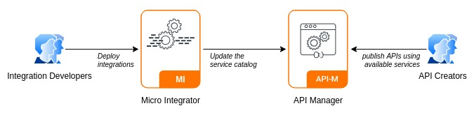

This scenario shows how to publish integrations to API Manager as available services and create APIs out of the published services

> **_NOTE:_** Please wait until the playground is ready to start the scenario.
