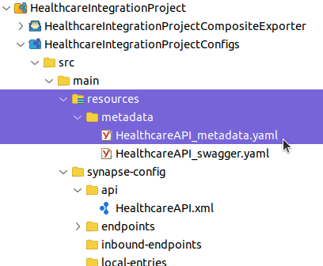

- [Optional] Create and Build the integration project.

    Follow the instruction in the official documentation and create an integration project. 
    
    https://apim.docs.wso2.com/en/latest/tutorials/integration-tutorials/service-catalog-tutorial/
    
    > NOTE: Generating the metadata files for the APIs, Proxy services is very important to publish services to APIM.
    > 

    or you could compile the bundled integration project using the below command.

    `mvn clean install -Dmaven.test.skip=true -f /root/resources/HealthcareIntegrationProject/pom.xml`{{exec}}

- Deploy the integration carbon application to micro integrator

    - Option 1: Deploy the pre-compiled artifact

        `cp /root/resources/HealthcareIntegrationProjectCompositeExporter_1.0.0.car mi/wso2mi-4.2.0/repository/deployment/server/carbonapps/`{{exec}}

    - Option 2: Deploy the artifact built from the above step 1.

        `cp /root/resources/HealthcareIntegrationProject/HealthcareIntegrationProjectCompositeExporter/target/HealthcareIntegrationProjectCompositeExporter_1.0.0.car /root/mi/wso2mi-4.2.0/repository/deployment/server/carbonapps/`{{exec}}

- Check the micro integrator logs

    `tail -f /root/mi/wso2mi-4.2.0/repository/logs/wso2carbon.log`{{exec}}

    You could see some log entries specifing the deployment of the service and creation of the entry in the service catalog of APIM.

```
INFO {org.apache.synapse.deployers.APIDeployer} - API named 'HealthcareAPI' has been deployed from file : /root/mi/wso2mi-4.2.0/tmp/carbonapps/-1234/xxxxxxxxxxxxxHealthcareIntegrationProjectCompositeExporter_1.0.0.car/HealthcareAPI_1.0.0/HealthcareAPI-1.0.0.xml
INFO {org.wso2.micro.integrator.initializer.deployment.application.deployer.CappDeployer} - Successfully Deployed Carbon Application : HealthcareIntegrationProjectCompositeExporter_1.0.0{super-tenant}
INFO {org.wso2.micro.integrator.initializer.serviceCatalog.ServiceCatalogDeployer} - Executing Service Catalog deployer for CApp : HealthcareIntegrationProjectCompositeExporter_1.0.0.car
INFO {org.wso2.micro.integrator.initializer.utils.ServiceCatalogUtils} - Successfully updated the service catalog
```

Continue to the next section.