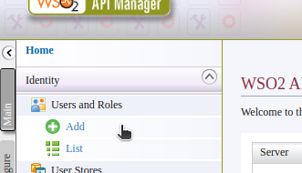
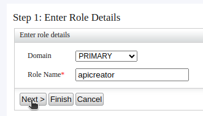
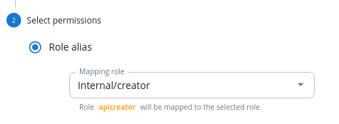

- Create the Role
  - Open the carbon management console and login in
    
    {{TRAFFIC_HOST1_80}}/carbon

  - Go to 'Main' > 'Users and Roles' > 'Add'

    

  - Select 'Add New Role'

    

  - Enter the prefered role name and click 'Next'

    use `apicreator`{{copy}} as the role name.

    

  - Select the 'Login' permissions from the permission tree.

    

    Please note that, usually following permissions are needed for the API Creation. Since the new UI is using scope based permission model, it is not a must to have these permissions.

      - 'Configure' > 'Governance' and all underlying permission
      - 'Login'
      - 'Manage' > 'API' > 'Create'
      - 'Manage' > 'Resources' > 'Govern' and all underlying permissions.

- Do the Scope mapping

  - Go to the admin portal using the below URL and login in with the admin user

    {{TRAFFIC_HOST1_80}}/admin

  - Go to the 'Scope Assignments' page

    

  - Click 'Add scope mappings' button and enter `apicreator` as the role name. Then click 'Next'

  - Select 'Internal/creator' option from the 'Mapping role' to apply the same scopes from it to our new role.

    

    Optionally, you could assign different set of scopes based on your usecase from the 'Custom scope assignments' section.

> Please note that it could take up to 15 minutes to reflect the new permission changes in the UI. Optionally you could restart the API Manager instance to force the changes.

Continue to the next section.