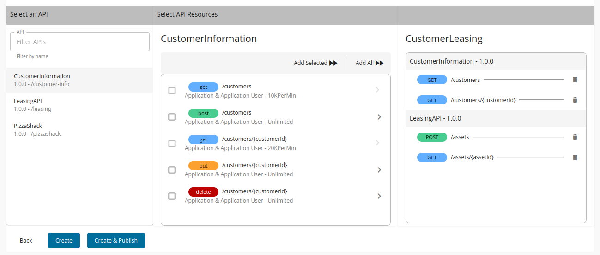

- Go to the API Manager Publisher portal and login as a publisher or click the API Publisher log if you are already in the Publisher portal. 

  For this lab, you could use the `admin` user, who has all the permissions.

  {{TRAFFIC_HOST1_80}}/publisher

- Click 'API Products' from the left manu bar and click 'API Product' option

- Provide below information and click 'Next'

  - Name: `CustomerLeasing`
  - Context: `/customer-leasing`

- Select the API resources
  - Click 'CustomerInfomation' API from the API list (left column) and move the following resources to right side
  
    - GET /customers
    - GET /customers/{customerId}

  - Click 'LeasingAPI' from the API list (left column) and move the following resources to right side
    - GET /assets/{assetId}
    - POST /assets

  

- Click 'Create & Publish'

  You could manager the API product from the publisher portal

Once done, a new API will be deployed in the gateways and appear on the devportal too.

  {{TRAFFIC_HOST1_80}}/devportal

Continue to the next section.