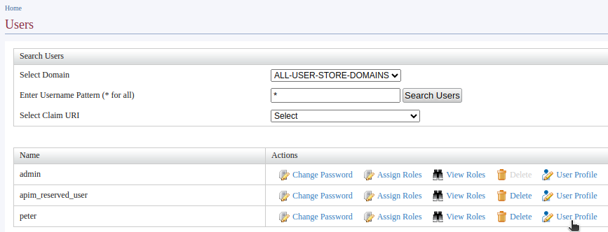
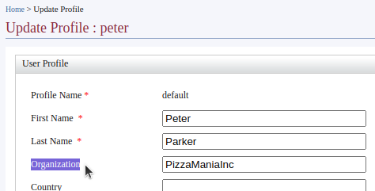
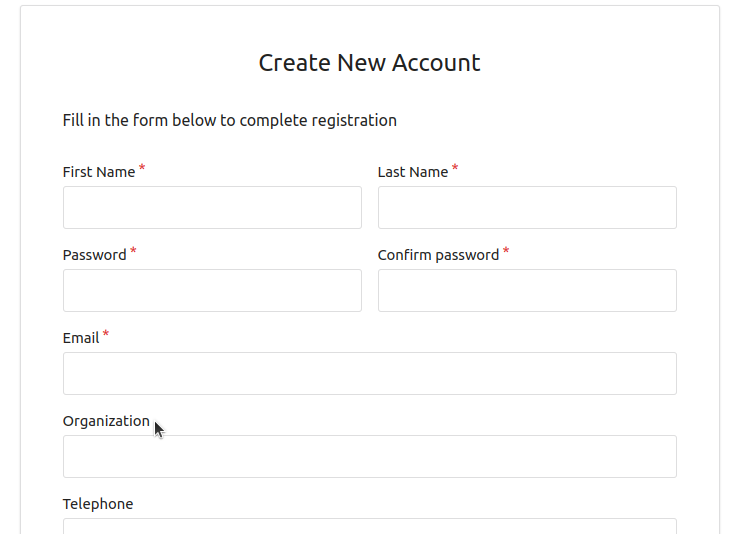

- Go to the carbon management console and login in using the 'admin' user
  
  {{TRAFFIC_HOST1_80}}/carbon

- Create a new user. This user will be the other team member who is going to manage the application we are going to create.

  - click 'Add' under 'Users and Roles' in the 'Main' menu
  - Click 'Add New User'
  - Create a new user called `peter` and assign the 'Internal/subscriber' role

- Update the organization claim
  - List the users and click 'profile' of the newly created user 'peter'

    

  - Click 'default' under the available profiles
  - Update the required fields and Enter `PizzaManiaInc` as the organization

    

NOTE: Instead of creating the user from carbon console, Self sign-up feature is also an option. You could define the Organization during the self signup process.

Continue to the next section.
