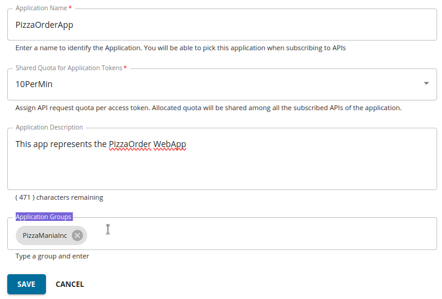

- Subscribe to the 'PizzaShack' API

  - Go to the Developer portal and login in with 'admin' user. 

    {{TRAFFIC_HOST1_80}}/devportal

  - Go to the 'Applications' page and start creating a new application. You will notice that there is a new field called 'Application Group'. Use the following details and create the application.
  
    - Name: `PizzaOrderApp`
    - Tier: '10PerMin' or your prefered plan
    - Description: `This app represents the PizzaOrder WebApp`
    - Application Group: `PizzaManiaInc`
    
    

    Click 'Save' once done.

  - Generate 'Production Keys'

Continue to the next section.