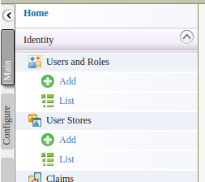
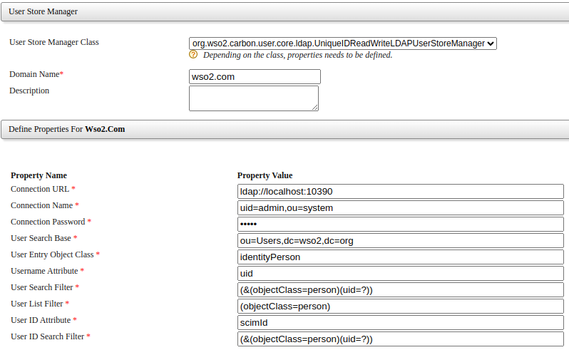

- Configure a Userstore

  - Go to the carbon management console and login as admin

    {{TRAFFIC_HOST1_80}}/carbon

  - Click 'Main' > 'User Stores' > 'Add' from the left menu. 

    

    UniqueIDReadWriteLDAPUserStoreManager
  - Use the following values and create the userstore.

    User Store Manager Class : 'UniqueIDReadWriteLDAPUserStoreManager' 
    Domain name: `wso2.com` 
    Connection URL: `ldap://localhost:10390` 
    Connection Name: `uid=admin,ou=system` 
    Connection Password: `admin` 
    User Search Base: `ou=Users,dc=wso2,dc=org` 
    User Entry Object Class: `identityPerson` 

    

  - Click 'Main' > 'User Stores' > 'List' from the left menu to see the newly created userstore. 

Continue to the next section.