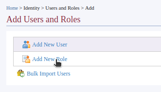
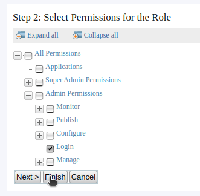
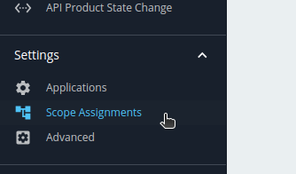

- Create the Role
  - Open the carbon management console and login in
    
    {{TRAFFIC_HOST1_80}}/carbon

  - Go to 'Main' > 'Users and Roles' > 'Add'

    

  - Select 'Add New Role'

    

  - Create the following roles with specified permissions

    Note: After you connect an external userstore, these roles could be the existing roles in the external user store. You could skip the role creation in that case and simply map the relevent permissions and scopes (will be doing in the next step) to existing roles.
  
    ```
    Role          Permission
    
    architect     Admin Permissions->Login
                  Admin Permissions->Manage->Search
                  Admin Permissions->Manage->Manage Tiers
                  Admin Permissions->Manage->API
                  Admin Permissions->Manage->Resources
    
    developer     Admin Permissions->Login
                  Admin Permissions->Manage->Search
                  Admin Permissions->Manage->API->Subscribe
                  Admin Permissions->Manage->API->Create
                  Admin Permissions->Manage->Resources

    bu_admin      All Permissions
    ```

    - Enter the role name and click 'Next'

    - Select the permissions from the permission tree and click 'Finish'.

      

- Do the Scope mapping

  Note: This scope mapping is the only step needed once you connect an external userstore, such as LDAP, if it already has roles and users created.

  - Go to the admin portal using the below URL and login in with the admin user

    {{TRAFFIC_HOST1_80}}/admin

  - Go to the 'Scope Assignments' page

    

  - Follow the steps below for each mapping and map the scopes for the new roles.

    ```
    Role          Mapping Role
    architect     Internal/publisher
    
    developer     Internal/creator
                  Internal/creator

    bu_admin      admin
    ```

    - Click 'Add scope mappings' button and enter a role name , e.g.: `architect`, then click 'Next'

    - Select existing role from the 'Mapping role' to apply the same scopes from it to our new role.

      

    Optionally, you could assign different set of scopes based on your usecase from the 'Custom scope assignments' section.

Similarly, you could create any other role to do API publishing, subscription or different combination based on your needs. More details about scope mapping could be found <a href="https://apim.docs.wso2.com/en/4.2.0/administer/managing-users-and-roles/managing-user-roles/#adding-role-mappings" target="_blank">here</a>

> Please note that it could take up to 15 minutes to reflect the new permission changes in the UI. Optionally you could restart the API Manager instance to force the changes.


Continue to the next section.