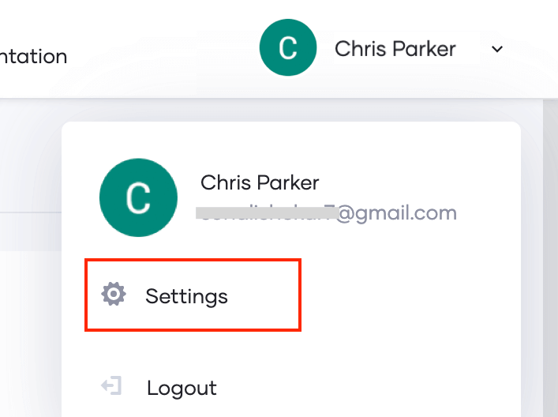
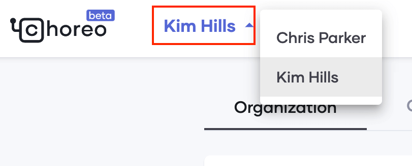
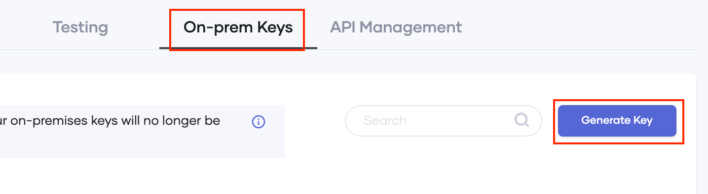

- Go to the choreo analytics cloud and login (or create an account if you don't have already)
  
  `https://console.choreo.dev`{{copy}}

- Register your environment

    - Click on the user profile in the top right corner and select 'Settings'

        

    - If you are a member of multiple organizations, select the appropriate organization from the top left-hand corner.

        
        
    - Select the 'On-prem Keys' tab and click 'Generate keys'

        

        Enter a suitable name for your environment (`killercoda-apim`) and click 'Generate'. Copy and keep the generated key securely before closing the dialog box.
    
        Note: As a free user, you are allowed to create maximum 3 tokens and each token will be valid for 2 weeks (14 days)

Continue to the next section.