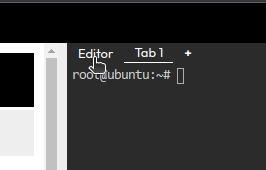

- [Optional] Build the 'CustomLogHandler' Java project. 

  - Open the custom handler to check the code

    `vi /root/CustomLogHandler/src/main/java/org/wso2/samples/handlers/CustomLogHandler.java`{{exec}}

    > Switch to the 'Editor' mode to use the online IDE.
    > 

  - Switch to the terminal and Compile the code using Maven. (this step will take around 30 mins to download all the dependancies from the maven repository as this is a fresh environment)

    `cd /root/CustomLogHandler`{{exec}}

    `mvn clean package`{{exec}}

- Copy the handler to APIM dropins directory (this custom handler is developed as a OSGI bundle, hence coping to the dropins directory)

    `cp /root/resources/CustomLogHandler-1.0-SNAPSHOT.jar /root/apim1/wso2am-4.5.0/repository/components/dropins/`{{exec}}

    - [Optional] If you want to use the jar file compiled from previous step, please use below command.

        `cp /root/CustomLogHandler/target/CustomLogHandler-1.0-SNAPSHOT.jar /root/apim1/wso2am-4.5.0/repository/components/dropins/`{{exec}}

- Update the API template file (velocity_template.xml) to include the custom handler.

    - open the velocity_template.xml file
    
        `vi apim1/wso2am-4.5.0/repository/resources/api_templates/velocity_template.xml`{{exec}}

    - Append the handler under the handlers section

        ```
        <handlers xmlns="http://ws.apache.org/ns/synapse">
            <!-- Start of the custom handler -->
            <handler xmlns="http://ws.apache.org/ns/synapse" class="org.wso2.samples.handlers.CustomLogHandler">
                <!-- derive the values from API object and pass to the handler -->
                <property name="APIName" value="$!apiName"/>
            </handler>
            <!-- End of the custom handler -->
                        #foreach( $handler in $handlers )
        ```
- Update the log4j2.properties file to log custom hander entries
    - Open the log4j2.properties file

      `vi apim1/wso2am-4.5.0/repository/conf/log4j2.properties`{{exec}}

    - Add the custom class log configuration and append it to loggers list

        ```
        logger.loghandler.name = org.wso2.samples.handlers.CustomLogHandler
        logger.loghandler.level = DEBUG
        ```{{copy}}

        ```
        loggers = AUDIT_LOG, trace-messages, ......, loghandler
        ```

- Restart the APIM service

    `sh apim1/wso2am-4.5.0/bin/api-manager.sh restart`{{exec}}

- Redeploy the PizzaShack API from the publisher 

    {{TRAFFIC_HOST1_80}}/publisher

- Go to the devportal and invoke the API

    {{TRAFFIC_HOST1_80}}/devportal

- Check the logs and you will see new log entries in te wso2 carbon logs from the custom handler. 

- You could copy the curl command from the devportal and invoke from your local machine. add the customer header to pass the ClientID value to the handler

    `curl -X 'GET' '{{TRAFFIC_HOST1_8080}}/pizzashack/1.0.0/menu' -H 'accept: application/json' -H 'Authorization: Bearer  <ACCESS_TOKEN>' -H 'X-ClientID: WSO2'`

Continue to the next section.