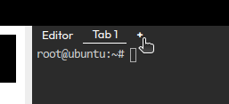

- Open a new terminal window

    

- Install Fluent Bit
  
  - Insatall flulent bit on ubuntu with provided script

    `curl https://raw.githubusercontent.com/fluent/fluent-bit/master/install.sh | sh`{{exec}}
  
  - create the fluent bit config files

    `mkdir /root/fluentbit`{{exec}}

    - labelmap.json
    
      `vi /root/fluentbit/labelmap.json`{{exec}}

      ```
      {
        "instance": "instance",
        "log_level": "log_level",
        "service": "service"
      }
      ```
    - parsers.conf

      `vi /root/fluentbit/parsers.conf`{{exec}}

      ```
      [PARSER]
        Name        observability
        Format      json
        Time_Key    time
        Time_Format %Y-%m-%dT%H:%M:%S.%L
      [PARSER]
        Name        wso2
        Format      regex
        Regex       \[(?<date>\d{2,4}\-\d{2,4}\-\d{2,4} \d{2,4}\:\d{2,4}\:\d{2,4}\,\d{1,6})\]  (?<log_level>[^\s]+) \{(?<class>[\s\S]*)\} ([-]) (?<service>\{[\s\S]*\})?(?<message>.*)
        Time_Key    date
            Time_Format %Y-%m-%d %H:%M:%S,%L
      ```

    - fluentbit.conf

      `vi /root/fluentbit/fluentbit.conf`{{exec}}

      ```
      [SERVICE]
        Flush        1
        Daemon       Off
        Log_Level    info
        Parsers_File /root/fluentbit/parsers.conf

      [INPUT]
        Name tail
        Path /root/mi1/wso2mi-4.1.0/repository/logs/*.log
        Mem_Buf_Limit  500MB
        Parser wso2

      [OUTPUT]
        Name loki
        Match *
        Url http://localhost:3100/loki/api/v1/push
        BatchWait 1
        BatchSize 30720
        Labels {job="fluent-bit"}
        LineFormat json
        LabelMapPath /root/fluentbit/labelmap.json
      ```

- Configure Fluent Bit grafana plugin

  - Clone the repository

    `cd /root/fluentbit/`{{exec}}

    `git clone https://github.com/grafana/loki.git`{{exec}}

  - Build the code

    `cd /root/fluentbit/loki`{{exec}}

    `make fluent-bit-plugin`{{exec}}

- Run the fluent bit

  `fluent-bit -e /root/fluentbit/loki/out_loki.so c /root/fluentbit/fluentbit.conf`{{exec}}

Continue to the next section.